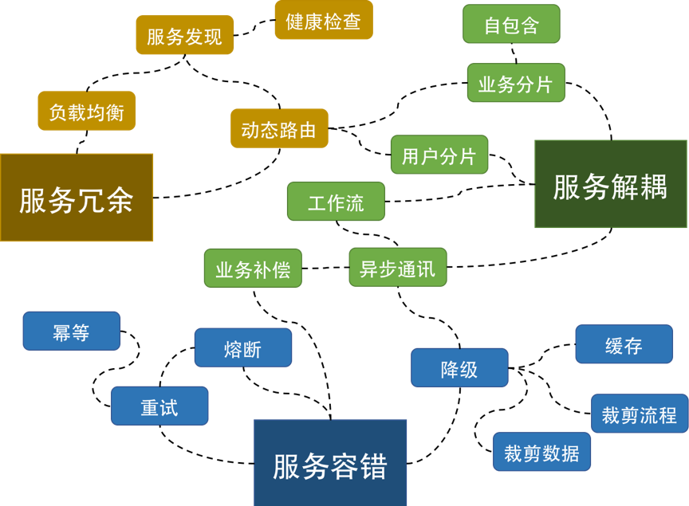

# Cultivate

Notice：

    1.使用markdown格式
    2.请在文章开头标注整理人
    3.不限于任何语言，不限于任何范畴，从技术到炒股，从青春到养生，从吹牛到扯淡，只要你喜欢

     

 Notice：
      
    1. use markdown type
    2. mark the person at the beginning of the article
    3. Not limited to any language, not limited to any category, from technology to stock trading, from youth to health, as long as you like it

1. Nginx
2. Redis
3. Kafka
4. PHP
5. Protocol
6. Python
7. Web
    
        Web相关的技术，比如CSS,JS缓存
8. application_scenario 
    
        一些真实应用场景的实现，涉及到方案，不在侧重于某一个技术

9. life_and_think

        生活，思考，随意啦，你喜欢就好，就像我喜欢茶
        
        
#### 相关文件地址：

1. [百度云](https://pan.baidu.com/s/1iIF_KvHQhTn80223glrw_Q)提取码: 5nic 

##### 感谢左耳朵耗子，涉及到的部分书籍推荐来自于左耳朵耗子的极客时间

##### 有效地分离 Logic、Control 和 Data 是写出好程序的关键所在！

## Contributors

Thanks goes to these wonderful people ([emoji key](https://github.com/all-contributors/all-contributors#emoji-key)):

<!-- ALL-CONTRIBUTORS-LIST:START - Do not remove or modify this section -->
<!-- prettier-ignore -->
| [ <b>尹少爷</b>](http://test.sorryu.cn) [🚧](#maintenance-childeYin "Maintenance") | [ <b>orangleliu</b>](http://blog.csdn.net/orangleliu) [🎨](#design-orangle "Design") | 
| :---: | :---: |
<!-- ALL-CONTRIBUTORS-LIST:END -->

This project follows the [all-contributors](https://github.com/all-contributors/all-contributors) specification. Contributions of any kind welcome!
