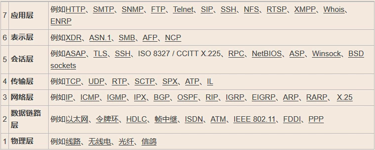
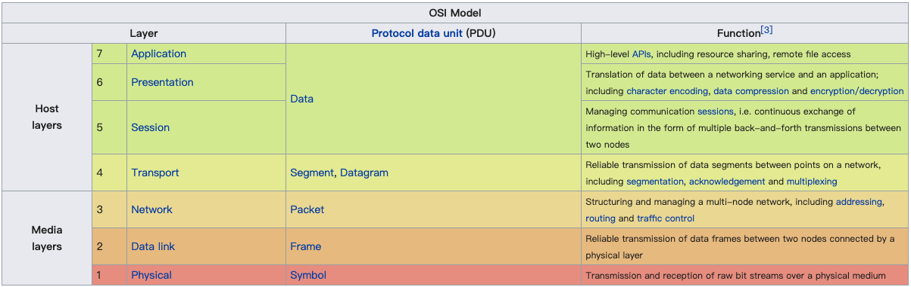

# Protocol

##  HTTP
1. HTTP 请求头，响应头
2. CSRF，XSS如何防御
3. HTTP GET vs POST,
4. HTTP Connection: keep-alivee with Content-Length, 
    - Connection: keep-alivee with Content-Length 连用，在复用的时候，可以知道自己接收完了信息
    - Transfer-Encoding: chunked 不需要Content-Length 因为chunk的最后一个包大小是0，必须是0 
5. [RFC 7540 :  HTTP/2 ](https://tools.ietf.org/html/rfc7540)
6. Session vs Cookie
7. [url输入之后发生了什么](http://fex.baidu.com/blog/2014/05/what-happen/)
    - 推荐一本书 《网络是怎么连接的》

## HTTPS  
1. [HTTPS](./https.md)

## Websocket
1. [RFC 6455:  WebSocket Protopol](https://tools.ietf.org/html/rfc6455)
2. [WebSocket详解](http://www.52im.net/forum.php?mod=viewthread&tid=331&ctid=15)

## TCP
1. TCP 三次握手，四次挥手
    - sync攻击
2. backlog数目，sync queue, accept queue
    
3. TCP粘包，以及如何处理
    - 明确规定每个包的大小
    - 每个包规定结束的字符，可以区分包
    
4. scoket参数TCP_NODELAY,SO_RCVTIMEO和SO_SNDTIMEO,
    - TCP_NODELAY 开始Nagle算法，减少需要传输的数据包，来优化网络
    - SO_RCVTIMEO, SO_SNDTIMEO接收和发送的超时时间
    
## Reading

* [keyless ssl原理](https://andblog.cn/?p=852)

* 网络各层和经典的协议

* 网络各层的数据最小单位

* 网络通讯协议图

