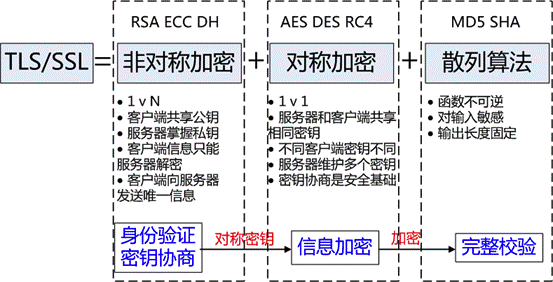

HTTPS
=====

HTTPS 是 HTTP Over TLS 的简称，具体协议内容参见 [RFC2818](https://tools.ietf.org/html/rfc2818)

**一次HTTPS协议交互的流程？涉及到哪些加密算法？**

简单的文字描述 (证书交换，key交换), 主要是SSL部分，其实还包括三次握手和HTTP 7层的交互

* tcp的三次握手是前提，HTTPS是在TCP层做的加密
* 客户端首先发起 `ClientHello`消息，包含了随机生成的数字random1，客户端支持的CipherSuite，以及协议版本
* 服务端收到客户端的 `ClientHello`消息之后，取出random1，取出客户端支持的加密算法，选择一个加密算法，生成一个随机数random2，发给客户端 `ServerHello`, 包括random2, sessionID, CipherSuite等, 同时服务端返回CA证书和加密公钥 (server hello done)
* 客户端收到服务端传来的证书后，先从 CA 验证该证书的合法性，验证通过后取出证书中的服务端公钥，再生成一个随机数 Random3，再用服务端公钥非对称加密 Random3 生成 PreMaster Key, 并将PreMaster Key发送到服务端
* 服务端通过私钥将PreMaster Key解密获取到Random3,此时客户端和服务器都持有三个随机数Random1 Random2 Random3,双方在通过这三个随机数生成一个对称加密的密钥.双方根据这三个随即数经过相同的算法生成一个密钥,而以后应用层传输的数据都使用这套密钥进行加密.
* 之后就是应用的消息传输(Encrypted Data Transfer Phase)，用的是对称加密

**Cipher Suite 是什么？例如 TLS_ECDHE_RSA_WITH_AES_128_GCM_SHA256**
    1、authentication (认证算法)：RSA
    2、encryption (加密算法 )：AEAD_AES_128_GCM
    3、message authentication code (消息认证码算法 简称MAC)：SHA256
    4、key exchange (密钥交换算法)：ECDHE
    5、key derivation function （密钥衍生算法)

**SSL和TLS 哪些版本不推荐使用，哪些版本推荐使用？**

不建议使用 SSL 2.0、SSL 3.0等SSL协议以及TLS 1.0等低版本TLS协议, 建议使用TLS v1.1或更高版本，强烈建议使用TLS v1.2, 最新的是 TLS v1.3

**Nginx为例，怎样优化HTTPS的性能，有哪些优化思路？**

* SNI
* session
* ticket

**CDN中怎样解决HTTPS的安全问题？**

可以参考文章 [keyless ssl原理](https://andblog.cn/?p=852)

**非对称加密算法RSA**

- [RSA (cryptosystem) Wiki](https://en.wikipedia.org/wiki/RSA_(cryptosystem))
- [阮一峰 RSA算法原理](http://www.ruanyifeng.com/blog/2013/06/rsa_algorithm_part_one.html)

